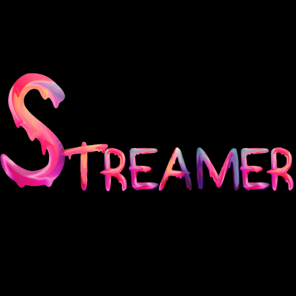

Date: 10/19/20

#### [LinkedIn](https://www.linkedin.com/in/samueltrahan/)

##Description

Streamer is a React application made to search for your favorite streamers on youtube.  You may also be able to see their live tweets.

The app is deploy using Vercel and can be found [here](https://streamer-g2ts56kxj.vercel.app/)
---

## Getting Started

Some streamers are set because those are the streamers that I enjoy watching but feel free to search for streamers that you watch on YouTube using their YouTube account name.

---

## Future Improvements

- [ ] Fix tweets so that they show up for each streamer searched.(Usernames are different on different platforms)
- [ ] Add in streamers twitch stream.
  
## Credits
Youtube API
Twitter API
Semantic UI
Materialize UI

